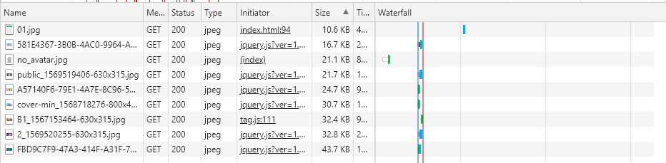
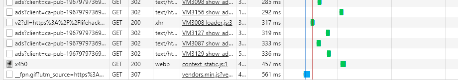
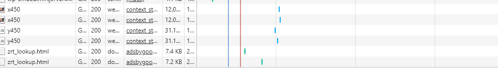
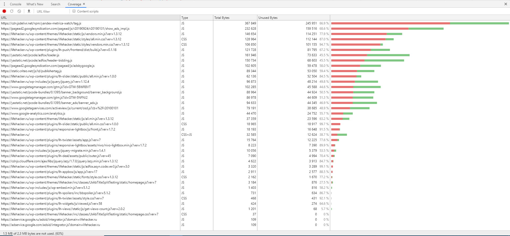

# shri_2019_devtools
Использование браузерного DevTools для анализ сайта

Браузер _Google Chrome  76.0.3809.132_, кэширование выключено, режим инкогнито.

## Вкладка Networks

Сохранненый har файл: [lifehacker.ru](./files/lifehacker.ru.har)
Неоптимальные места:
- Достаточно много неоптимизированных больших картинок в формате jpeg

- Запрос на https://sync.vertamedia.com/csync/ идет пол секунды

- Картинки из запроса https://avatars.mds.yandex.net/get-direct/* грузятся по 4-5 раз.
- Дублируюся запросы https://googleads.g.doubleclick.net/pagead/html 

## Вкладка Performance

Сохранненный профайл: [lifehacker.ru](./files/lifehacker.ru.profile.json)

**Время в миллисекундах от начала загрузки до событий:**

Событие | Среднее время (мс)
------- | ------------------
First Paint| 400
First Meaningful Paint | 420
DOM Content Loaded| 2300
Load| 6730

**Время в миллисекундах затрачиваемое на разные этапы обработки документа:**

Этап обработки | Среднее время (мс)
-------------- | --------------
Loading|117
Scripting|3486
Rendering|1493
Painting|335

##Вкладка Coverage
 Скриншот вкладки сразу после загрузки
 
 
 Объём неиспользованного CSS в ходе загрузки страницы: ~235 KB
 Объём неиспользованного JS в ходе загрузки страницы: ~1240 KB

